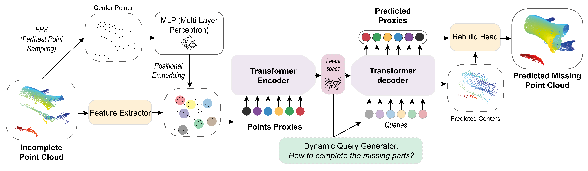
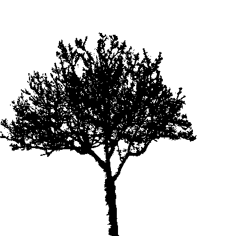
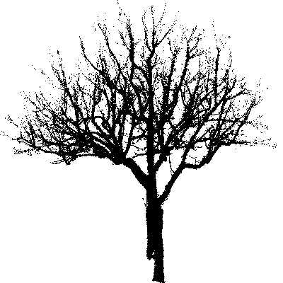
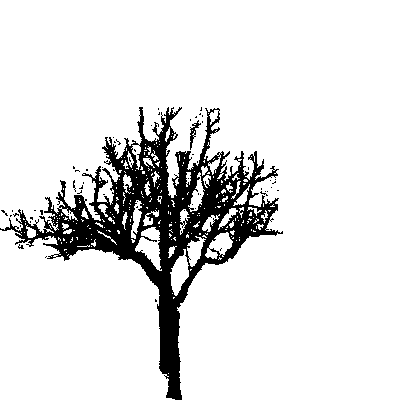

# AdaPoinTr_UrbanTrees

Additional visuals illustrating urban tree point cloud reconstruction with **AdaPoinTr**.

---

## Visual Companion Overview

This repository provides **complementary visuals** for our study on 3D point cloud completion and denoising of urban trees using **AdaPoinTr**, a transformer-based deep learning model.  
It includes:
- A **diagram** of the model architecture  
- **3D GIFs** comparing:
  - TLS (ground-truth data)  
  - SfM-MVS photogrammetry (noisy and incomplete)  
  - AdaPoinTr reconstructions  

These visuals complement our poster and manuscript (linked via QR code), offering an accessible overview of the workflow and results.

---

## About this Study

- **Goal:** Improve urban tree point clouds from smartphone photogrammetry to approach TLS standards  
- **Methods:** AdaPoinTr completion model with two-stage fine-tuning (synthetic + TLS data)  
- **Evaluation:** Chamfer Distance and M3C2 metrics for 3D accuracy  

---

## Architecture Overview

---

## Visual Results

### Example: TLS vs SfM-MVS vs AdaPoinTr Completion

  

    
    
TLS (Ground Truth)

  

  

    
    
SfM-MVS (Noisy)

  

  

    
    
AdaPoinTr Completion

  

---

## About the Author

**Main Author:** Lola Bricout (CNRS - LETG Laboratory, Rennes, France)

**Contact:** lola.bricout@univ-rennes2.fr  

