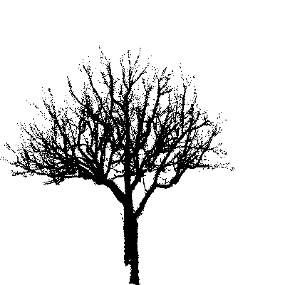

# AdaPoinTr_UrbanTrees

Complementary visuals for the poster:

**"Enhancing 3D point clouds of urban trees using deep learning"**

*AI4EO Symposium 2025.*

*Work conducted as part of a Master 2 internship (Master TELENVI (Rennes 2 University): Remote Sensing and Environment).*

---

## Visual Companion

This repository provides **complementary visuals** for our study.
It includes:
- A **diagram** of the model architecture  
- **3D GIFs** comparing tree point clouds:
  - TLS (terrestrial Laser Scanning)  
  - SfM-MVS photogrammetry (Colmap software) → with AdaPoinTr completion/denoising  
  - 3D Gaussian Splatting (3DGS) → with AdaPoinTr completion/denoising

---

## References

This work builds upon the following studies and codebases:  
- [PoinTr](https://github.com/yuxumin/PoinTr)  
- [TreePoinTr](https://github.com/alBrnd/treePoinTr)

---

## Architecture Overview

---

## Visual Results

### Example (Fraxinus excelsior):

  

    
    
TLS (LiDAR)

  

  

    
    
SfM-MVS (Colmap)

  

  

    
    
AdaPoinTr Completion of SfM-MVS

  

  

    
    
3D Gaussian Splatting (3DGS)

  

  

    
    
AdaPoinTr Completion of 3DGS

  

---

## Key Finding

- **AdaPoinTr can potentially improve 3D tree models obtained from smartphone photos.** Fine branches at the edges of the tree are often missing when the input point cloud is sparse (<2,048 points per 1 m³ cube), but the overall structure of trunks and main branches is well reconstructed.

> **Note:** Evaluation metrics (Chamfer Distance, F-score, M3C2, AdQSM) were computed but are not displayed here.

## Potential Improvements

- **Fine-tune AdaPoinTr on larger datasets with realistic occlusions**, similar to smartphone photogrammetry (SfM-MVS).  
- **Process entire trees without dividing into sub-clouds**, to better preserve fine branches and structural coherence.

> AdaPoinTr shows promise for generating accurate 3D tree models from low-cost data, offering a step toward accessible urban tree monitoring.

---

## Authors & Affiliations

- **L. Bricout¹, P.M. Houngan¹, A. Padonou¹², S. El Moualy², L. Hubert-Moy¹, T. Corpetti¹, J. Nabucet¹**

¹ LETG Rennes, Université Rennes 2 / CNRS, UMR 6554, Rennes, France  
² SCOP Aubépine, Rennes, France

**Contact:** lola.bricout@univ-rennes2.fr  

